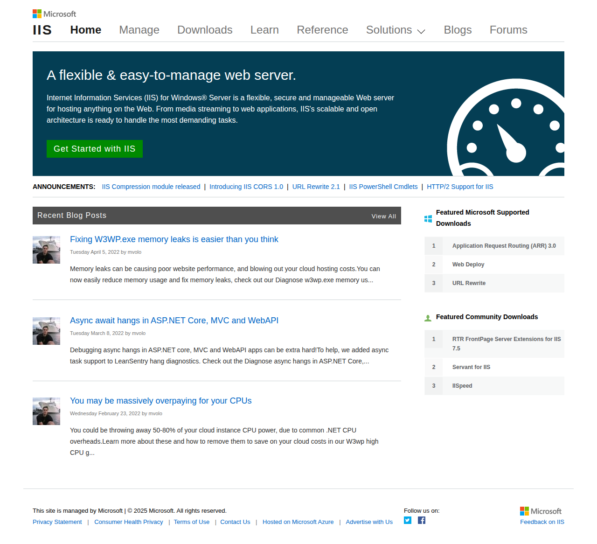

# Visited: http://go.microsoft.com/fwlink/?linkid=66138&clcid=0x409
**Time:** Thu May 14 16:04:26 UTC 2026

## Screenshot

## Raw HTML
[page.html](./page.html)

## Downloaded Media (0 files)
_No media files downloaded_

## Other Links
- [#](#)
- [#hero](#hero)
- [/](/)
- [//blogs.iis.net/roman/archive/2013/07/26/application-request-router-arr-3-0-rtm-is-now-available.aspx](//blogs.iis.net/roman/archive/2013/07/26/application-request-router-arr-3-0-rtm-is-now-available.aspx)
- [//www.asp.net](//www.asp.net)
- [/Content/downloads.css](/Content/downloads.css)
- [/Content/home.css](/Content/home.css)
- [/Scripts/jquery-3.7.1.js](/Scripts/jquery-3.7.1.js)
- [/Scripts/main.js](/Scripts/main.js)
- [/contact](/contact)
- [/downloads](/downloads)
- [/downloads/community/2011/07/rtr-frontpage-server-extensions-for-iis-75-on-windows-server-2008-r2-and-windows-7](/downloads/community/2011/07/rtr-frontpage-server-extensions-for-iis-75-on-windows-server-2008-r2-and-windows-7)
- [/downloads/community/2013/05/iispeed](/downloads/community/2013/05/iispeed)
- [/downloads/community/2013/05/servant-for-iis](/downloads/community/2013/05/servant-for-iis)
- [/downloads/microsoft/iis-compression](/downloads/microsoft/iis-compression)
- [/downloads/microsoft/url-rewrite](/downloads/microsoft/url-rewrite)
- [/overview](/overview)
- [/terms-of-use](/terms-of-use)
- [https://aka.ms/yourcaliforniaprivacychoices](https://aka.ms/yourcaliforniaprivacychoices)
- [https://azure.microsoft.com/](https://azure.microsoft.com/)
- [https://blogs.iis.net/](https://blogs.iis.net/)
- [https://blogs.iis.net/bariscaglar/iisadministration-powershell-cmdlets-new-feature-in-windows-10-server-2016](https://blogs.iis.net/bariscaglar/iisadministration-powershell-cmdlets-new-feature-in-windows-10-server-2016)
- [https://blogs.iis.net/davidso/http2](https://blogs.iis.net/davidso/http2)
- [https://blogs.iis.net/iisteam/introducing-iis-cors-1-0](https://blogs.iis.net/iisteam/introducing-iis-cors-1-0)
- [https://blogs.iis.net/iisteam/url-rewrite-v2-1](https://blogs.iis.net/iisteam/url-rewrite-v2-1)
- [https://blogs.iis.net:443/mvolo/Async-await-hangs-in-ASPNET-Core-MVC-and-WebAPI](https://blogs.iis.net:443/mvolo/Async-await-hangs-in-ASPNET-Core-MVC-and-WebAPI)
- [https://blogs.iis.net:443/mvolo/Contents/Item/Display/1781](https://blogs.iis.net:443/mvolo/Contents/Item/Display/1781)
- [https://blogs.iis.net:443/mvolo/You-may-be-massively-overpaying-for-your-CPUs](https://blogs.iis.net:443/mvolo/You-may-be-massively-overpaying-for-your-CPUs)
- [https://code.visualstudio.com/](https://code.visualstudio.com/)
- [https://consentdeliveryfd.azurefd.net/mscc/lib/v2/wcp-consent.js](https://consentdeliveryfd.azurefd.net/mscc/lib/v2/wcp-consent.js)
- [https://docs.microsoft.com/en-us/IIS-Administration/](https://docs.microsoft.com/en-us/IIS-Administration/)
- [https://docs.microsoft.com/en-us/iis/configuration/](https://docs.microsoft.com/en-us/iis/configuration/)
- [https://docs.microsoft.com/iis/](https://docs.microsoft.com/iis/)
- [https://facebook.com/inetsrv/](https://facebook.com/inetsrv/)
- [https://forums.iis.net/](https://forums.iis.net/)
- [https://forums.iis.net/1080.aspx](https://forums.iis.net/1080.aspx)
- [https://go.microsoft.com/fwlink/?LinkId=521839](https://go.microsoft.com/fwlink/?LinkId=521839)
- [https://go.microsoft.com/fwlink/?linkid=2259814](https://go.microsoft.com/fwlink/?linkid=2259814)
- [https://js.monitor.azure.com/scripts/c/ms.analytics-web-4.min.js](https://js.monitor.azure.com/scripts/c/ms.analytics-web-4.min.js)
- [https://manage.iis.net](https://manage.iis.net)
- [https://microsoft.com/](https://microsoft.com/)
- [https://php.iis.net/](https://php.iis.net/)
- [https://support.microsoft.com/en-US/contactus](https://support.microsoft.com/en-US/contactus)
- [https://visualstudio.microsoft.com/](https://visualstudio.microsoft.com/)
- [https://www.effectusmedia.com/?site=iis#contactus](https://www.effectusmedia.com/?site=iis#contactus)
- [https://www.microsoft.com](https://www.microsoft.com)
- [https://www.microsoft.com/en-us/cloud-platform/windows-server](https://www.microsoft.com/en-us/cloud-platform/windows-server)
- [https://www.microsoft.com/en-us/download/details.aspx?id=43717](https://www.microsoft.com/en-us/download/details.aspx?id=43717)
- [https://www.microsoft.com/en-us/sql-server/](https://www.microsoft.com/en-us/sql-server/)
- [https://www.microsoft.com/net](https://www.microsoft.com/net)

## Stats
- Links: 56
- Media: 0
